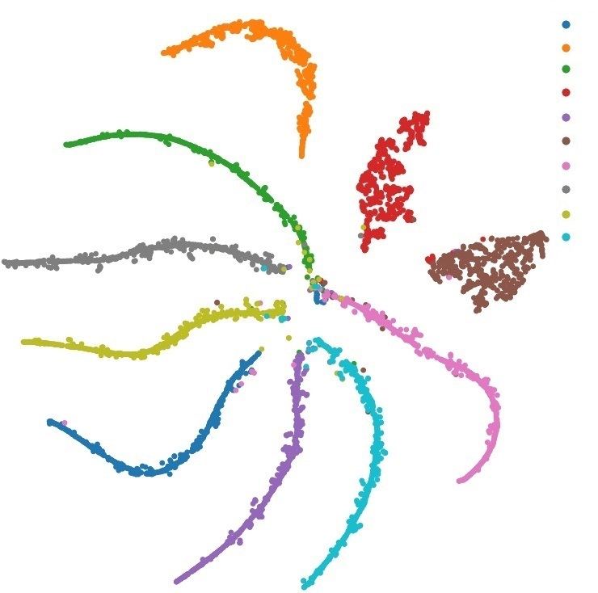
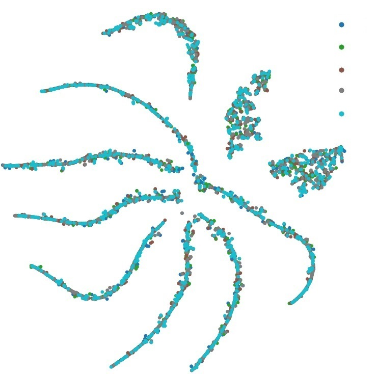
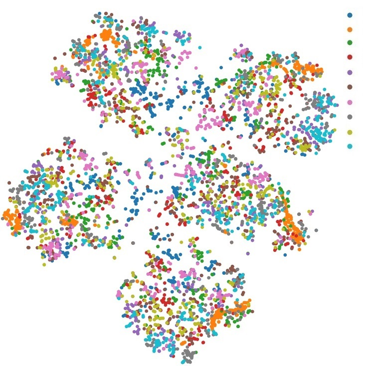
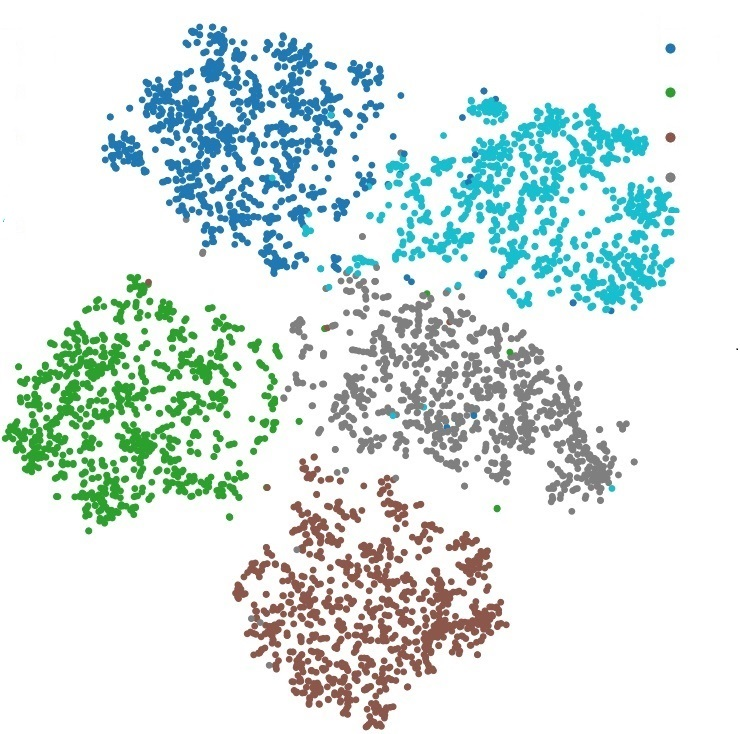
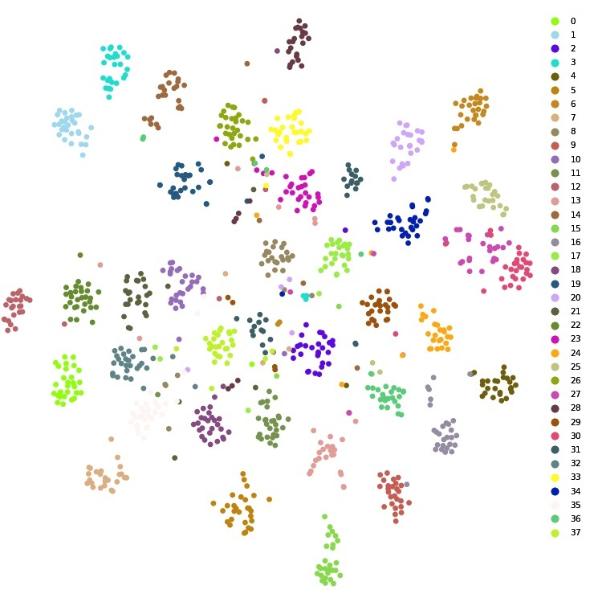
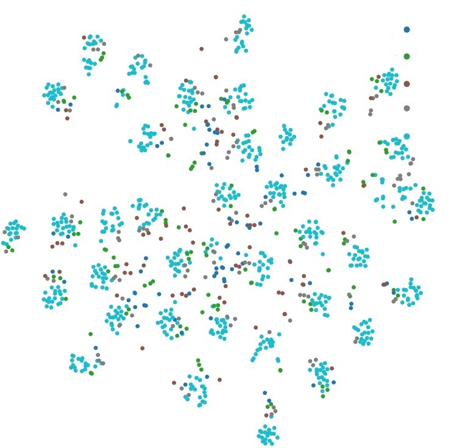
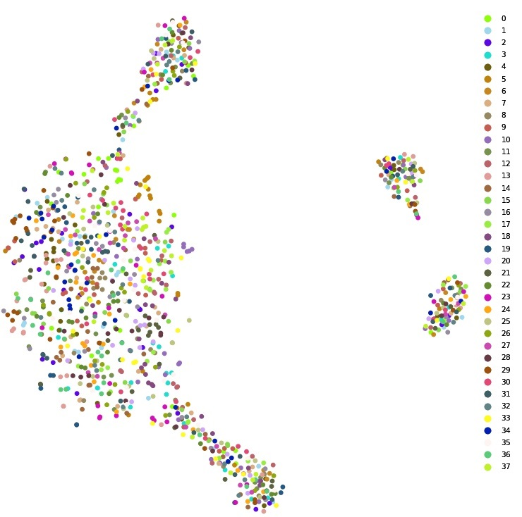
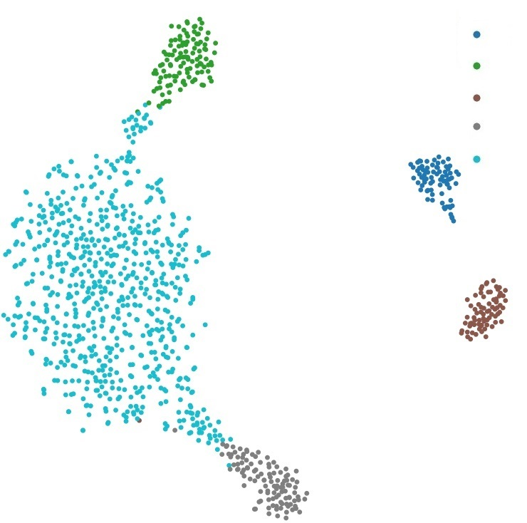

## Code for the paper  titled Information Bottleneck Disentanglement Based Sparse Representation for Fair Classification

**(a) the distribution of $z_c$ under $c$, different colors represent different category labels** 

      

**(b) the distribution of $z_c$ under $s$, different colors represent different sensitive labels** 

       

**(c) the distribution of $z_s$ under $c$, different colors represent different category labels** 

        

**(d) the distribution of $z_s$ under $s$, different colors represent different sensitive labels** 

### The t-SNE visualization of $z_c$ and $z_s$ corresponding to 5000 samples in the MNIST-ROT test dataset. From (a), $z_{c}$ can be gathered to form different sample clusters according to $c$. While the rotation angle label, as shown in (b), can only produce a relatively uniform distribution, test samples with different rotation angles are distributed in each cluster. Similar rules are also reflected in the (d) and (c).

**(e) the distribution of $z_c$ under $c$, different colors represent different category labels** 

      

**(f) the distribution of $z_c$ under $s$, different colors represent different sensitive labels** 

       

**(g) the distribution of $z_s$ under $c$, different colors represent different category labels** 

        

**(h) the distribution of $z_s$ under $s$, different colors represent different sensitive labels** 

### The t-SNE visualization of $z_c$ and $z_s$ corresponding to 1096 samples in the Extended YaleB test dataset. From (e), $z_{c}$ can be gathered to form different sample clusters according to y. While the sensitive label $s$, as shown in (f), can only produce a relatively uniform distribution, test samples with different sensitive labels are distributed in each cluster. Similar rules are also reflected in the (g) and (h).

#### A released version will be coming soon...
